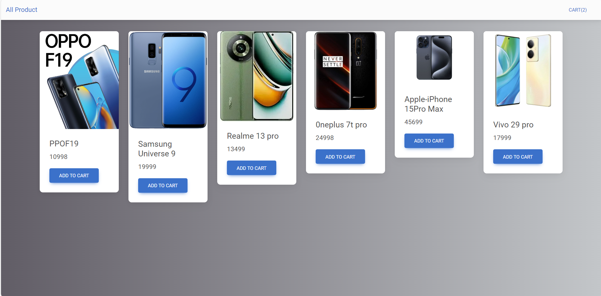
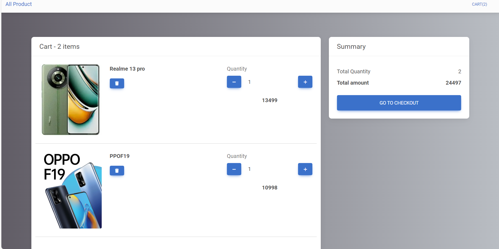

# React Redux Shopping Cart

This project is a simple shopping cart application built using React and Redux Toolkit. It allows users to browse products, add items to the cart, increase/decrease item quantities, and view a summary of the cart.

## Features

- Display a list of products
- Add items to the cart
- Remove items from the cart
- Increase or decrease item quantities in the cart
- View total quantity and total price of items in the cart

## Getting Started

### Prerequisites

Make sure you have the following installed on your local development environment:

- Node.js
- npm (or yarn)

### Installation

1. Clone the repository:

    ```bash
    git clone https://github.com/sugumar-MS/React-Redux-Task.git
    ```

2. Navigate to the project directory:

    ```bash
    cd React-Redux-Task
    ```

3. Install dependencies:

    ```bash
    npm install
    ```

### Running the Application

To start the development server, run:

    ```bash

    npm run dev
    
    ```



